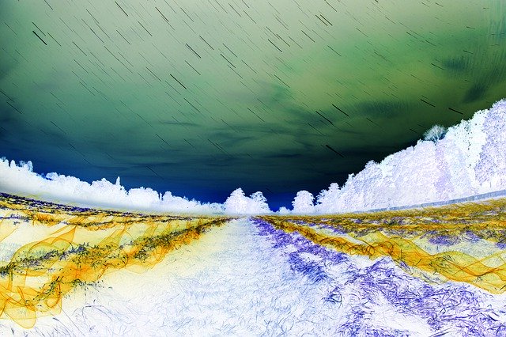

# 🖼️ BIMP
**BIMP** (Bitmap Image Manipulation Program) is a free and opensource cli program for windows, linux and mac systems.It allows users to perform operation like color inversion, grayscaling, adjusting brightness and constrast, color-channel filter etc.
## Current Status 
All core features have been implemented by our team members and we are working hard to implement more/optional fatures and fixing bugs.
## Core Features
- ✔️ Color Inversion          - Anjali
- ✔️ Gray Scaling             - Aradhana
- ✔️ Gamma Correction         - Divyanshi 
- ✔️ Adjusting Brightness     - Alok
- ✔️ Adjusting Contrast       - Anand
- ✔️ Sepia                    - Prashant
- ✔️ Color channel filter     - Kumar Gaurav
- ✔️ Saturation               - Vineet
## Optional Feature
- ⛔ Rotate 
- ⛔ Resize
- ⛔ Horizontal/Vertical flip etc
## Project Report : https://drive.google.com/file/d/1y_DWS63yBcA5Ruik6g_AGOSvATWsr_uk/view?usp=drive_link
## Screenshots

#### Grayscaled


#### Inverted


#### Gamma Adjusted


#### Green Channel


## Installation/ Usage 

### Development Strucuture
```
bimp/
├── main.c              # Entry point of the program
├── tools.c             # Core image manipulation functions
├── tools.h             # Header file for function declarations/prototypes
├── assets/             # Sample input images & screenshots
└── README.md           # Documentation for BIMP program
```

### 🧩 Clone the Repository
#### Installing GCC + Make 
- Ubuntu / Debian / Kali ```sudo apt install build-essential```
- Fedora / Rocky / AlmaLinux ```sudo dnf groupinstall "Development Tools"```
- CentOS / RHEL ```sudo yum groupinstall "Development Tools"```
- Arch / Manjaro ```sudo pacman -S base-devel```
- openSUSE	```sudo zypper install -t pattern devel_basis```
- Alpine	```sudo apk add build-base```
- Gentoo	```sudo emerge --ask sys-devel/gcc sys-devel/make```
```bash
git clone https://github.com/nish12965/bimp.git
cd bimp
make
./bimp
```


### 👥 Team Members

| No. | Name | LinkedIn | GitHub |
|-----|------|-----------|--------|
| 1 | **Anand Kumar Maurya** | [LinkedIn](https://www.linkedin.com/in/anand-maurya542/) | [GitHub](https://github.com/Anand-Maurya542) |
| 2 | **Anjali Kumari** | [LinkedIn](https://www.linkedin.com/in/anjalii1803/) | [GitHub](https://github.com/anjalii1803) |
| 3 | **Arun Singh** | [LinkedIn](https://www.linkedin.com/in/arun-bisht-31120624b/) | [GitHub](https://github.com/bishtarun169) |
| 4 | **Vineet Sikarwar** | [LinkedIn](https://www.linkedin.com/in/vineet-sikarwar-bba6542b3/) | [GitHub](https://github.com/VINEET-SIKARWAR) |
| 5 | **Aradhana Patidar** | [LinkedIn](https://www.linkedin.com/in/aradhana-patidar-118280381/) | [GitHub](https://github.com/aradhanapatidar) |
| 6 | **Alok Kumar** | [LinkedIn](https://www.linkedin.com/in/alok-kumar-70b638261/) | [GitHub](https://github.com/REALOKkumar) |
| 7 | **Bittu Kumar** | [LinkedIn](https://www.linkedin.com/in/bittu-kumar-5b9934235/) | [GitHub](https://github.com/Bittu9122-coder) |
| 8 | **Divyanshi Lilhore** | [LinkedIn](https://www.linkedin.com/in/divyanshi-lilhore-249283381/) | [GitHub](https://github.com/divyanshililhore) |
| 9 | **Kumar Gaurav** | [LinkedIn](https://www.linkedin.com/in/kumar-gaurav-85305022a/) | [GitHub](https://github.com/Kumar-Gaurav1) |
| 10 | **Nishant Kumar** | [LinkedIn](https://www.linkedin.com/in/nishant128/) | [GitHub](https://github.com/nish12965) |
| 11 | **Vadithya Prashanth** | [LinkedIn](https://www.linkedin.com/in/vadithya-prashanth-1a267736a/) | [GitHub](https://github.com/vadithyaprashanth) |

## Licence 
This project is licenced under the **GNU general Public Licence v3 (GPL-3.0)**
See more details here, [GPL v3 licence](https://www.gnu.org/licenses/gpl-3.0.en.html).

## Donation
This project is maintained by college students. If you find BIMP useful and would like to ensure its continued development and maintenance, please consider sponsoring the project. Thank you for your support.
- UPI ID 1 : **12pcm.anandmaurya@okhdfcbank**
- UPI ID 2 : **singharun9754-1@oksbi**
